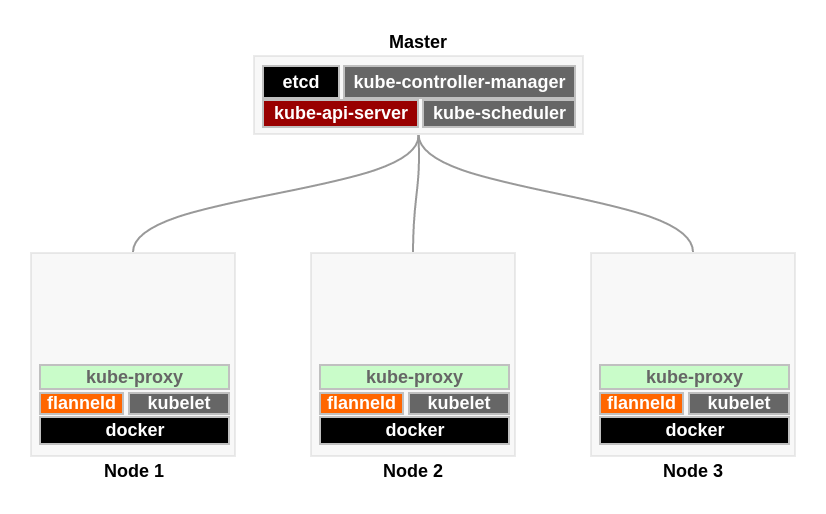

# 安装 k8s （手动）


## 参考

- [Creating a Custom Cluster from Scratch](https://kubernetes.io/docs/getting-started-guides/scratch/)


## 准备

- 2-4 台 host（物理机或虚拟机）
- 操作系统使用最新的 CentOS / Ubuntu x86_64
- Kubernetes releases 1.7.2

### 部署架构图



说明：

- `Master` 为一台 host ，部署集群需要的服务
- `Node 1` , `Node 2`, `Node 3` 为 work 节点
- etcd
- flanneld 为 overlay 网络

| 节点 | IP |
|------|----|
| k8s-master | 192.168.122.58 |
| k8s-node-1 | 192.168.122.59 |
| k8s-node-2 | 192.168.122.60 |
| k8s-node-3 | 192.168.122.61 |

## 步骤

### Master


#### etcd

安装 etcd ：

    yum install -y etcd

编辑 `/etc/etcd/etcd.conf` , 修改 ：

    ETCD_LISTEN_CLIENT_URLS="http://0.0.0.0:2379"

重启 etcd ：

    systemctl restart etcd


#### kube-apiserver

```
kube-apiserver \
    --insecure-bind-address=0.0.0.0 \
    --insecure-port=8080 \
    --etcd-servers=http://192.168.122.58:2379 \
    --service-cluster-ip-range=10.254.0.0/16
```

#### kube-scheduler

```
kube-scheduler --master=http://192.168.122.58:8080
```

#### kube-controller-manager

```
kube-controller-manager --master=http://192.168.122.58:8080
```


### Node

以 k8s-node-1 为例

#### kubelet

##### 旧的启动方式

```
kubelet \
    --api-servers=http://192.168.122.58:8080 \
    --pod-infra-container-image=ibmcom/pause:3.0
```

##### 新启动方式

创建 `kubeconfig` 配置文件：

```
kubectl config set-cluster kubernetes \
    --server=http://192.168.122.58:8080 \
    --kubeconfig=kubeconfig
# 设置上下文参数
kubectl config set-context default \
    --cluster=kubernetes \
    --user=kubelet \
    --kubeconfig=kubeconfig
# 设置默认上下文
kubectl config use-context default --kubeconfig=kubeconfig
```

生成的 `kubeconfig` 配置文件如下：

```yaml
apiVersion: v1
clusters:
- cluster:
    server: http://192.168.122.58:8080
  name: kubernetes
contexts:
- context:
    cluster: kubernetes
    user: kubelet
  name: default
current-context: default
kind: Config
preferences: {}
users: []
```

启动 kubelet :

```
kubelet --require-kubeconfig --kubeconfig=kubeconfig \
    --pod-infra-container-image=ibmcom/pause:3.0
```

**注意** 默认路径 `/var/lib/kubelet/kubeconfig`


#### kube-proxy

##### 旧的启动方式

```
kube-proxy --master=http://192.168.122.58:8080
```

#### 新的启动方式

```
kube-proxy --kubeconfig=kubeconfig
```

#### 问题

##### pause 映像替换

https://hub.docker.com/r/ibmcom/pause/

```
--pod-infra-container-image=ibmcom/pause:3.0
```


## 模块说明

### Flannel

```
kubectl apply -f  kube-flannel.yml
```

查看:

```
kubectl get ds --all-namespaces -o wide
```

查看详细描述：

```
kubectl describe ds kube-flannel-ds --namespace kube-system
```

#### 错误

```
The DaemonSet "kube-flannel-ds" is invalid: spec.template.spec.containers[0].securityContext.privileged: Forbidden: disallowed by cluster policy
```

以 `--allow-privileged` 启动　kubelet, kube-apiserver

## 参考

- [Battlefield: Calico, Flannel, Weave and Docker Overlay Network](http://chunqi.li/2015/11/15/Battlefield-Calico-Flannel-Weave-and-Docker-Overlay-Network/)
